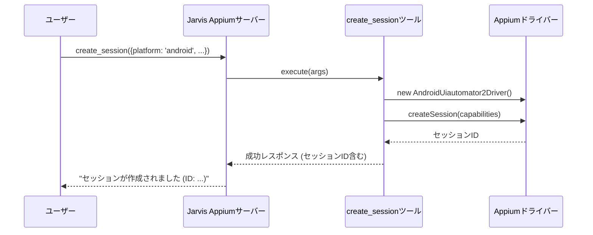
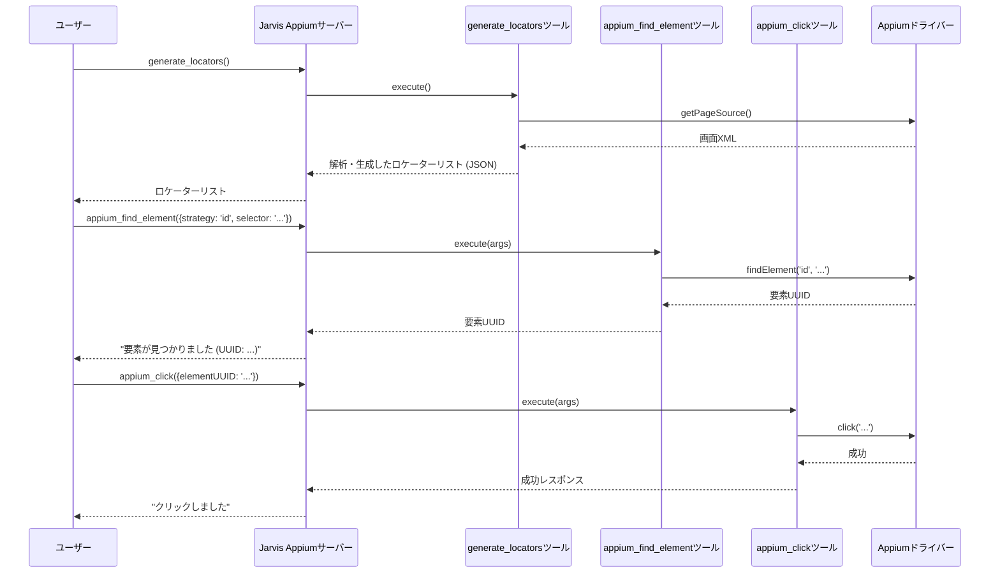
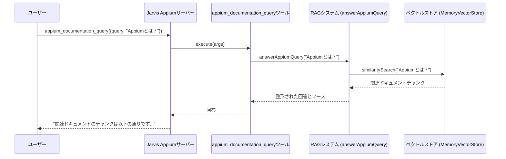
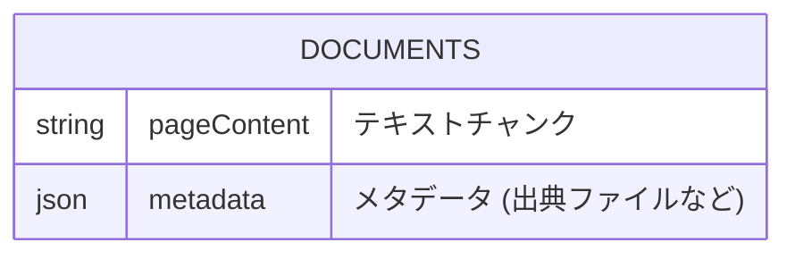

# 技術仕様書：Jarvis Appium

## 1. 概要

このソフトウェアは、AIアシスタントがAppiumを通じたモバイルアプリケーションの自動テストや操作を容易に行えるようにするためのバックエンドサーバーです。主要な機能として、Appiumセッションの管理（ローカルおよびクラウド）、UI要素の特定と操作、そしてAppium公式ドキュメントに対する自然言語での問い合わせ機能（RAG）を提供し、モバイル自動化のタスクを効率化・高度化することを目的としています。

## 2. プロジェクト構造とアーキテクチャ

### 2.1. プロジェクト構造

```
/Users/raiko.funakami/GitHub/jarvis-appium/
├───src/
│   ├───index.ts                # サーバー起動のエントリポイント
│   ├───server.ts               # FastMCPサーバーの初期化と設定
│   ├───tools/                  # AIアシスタントに提供される各種ツール（機能）の実装
│   │   ├───interactions/       # クリック、テキスト入力などの基本的なUI操作ツール
│   │   └───documentation/      # RAG（検索拡張生成）関連の実装
│   ├───locators/               # 画面要素のロケーターを生成・解析するロジック
│   ├───resources/              # ドキュメント原文(md)やコードテンプレートなどのリソース
│   ├───scripts/                # ドキュメントのインデックス作成などを実行する補助スクリプト
│   ├───tests/                  # ユニットテスト
│   └───types/                  # 型定義ファイル
├───package.json                # プロジェクトの依存関係とスクリプト定義
└───tsconfig.json               # TypeScriptのコンパイラ設定
```

- **`src/`**: すべてのソースコードが格納されるメインディレクトリ。
- **`src/tools/`**: このプロジェクトの中核となる機能群。`FastMCP`プロトコルを通じてAIアシスタントに公開される「ツール」として実装されています。セッション作成、要素操作、ドキュメント検索などが含まれます。
- **`src/tools/documentation/`**: Appiumドキュメントを検索するためのRAGシステム。テキストのインデックス化、ベクトル検索、推論機能が実装されています。
- **`src/locators/`**: モバイルアプリの画面ソース（XML）を解析し、UI要素を特定するための推奨ロケーター（XPath, IDなど）を生成するロジックが含まれています。
- **`src/resources/`**: RAGの検索対象となるAppiumのドキュメント（Markdown形式）や、コード生成機能で利用されるテンプレートが格納されています。
- **`src/scripts/`**: `resources`内のドキュメントをベクトル化し、検索可能なインデックスを作成するためのスクリプトなどが含まれています。

### 2.2. 主要な技術スタック

- **言語**: TypeScript
- **フレームワーク/ライブラリ**:
    - **`fastmcp`**: AIアシスタントとツールサーバー間の通信プロトコル（Model Context Protocol）を提供するコアフレームワーク。
    - **`appium-uiautomator2-driver`**: Androidアプリの自動化を行うためのAppiumドライバー。
    - **`appium-xcuitest-driver`**: iOSアプリの自動化を行うためのAppiumドライバー。
    - **`@xenova/transformers`**: 自然言語処理モデル（埋め込み生成や要約など）をローカルで実行するためのライブラリ。APIキーが不要で、RAG機能の心臓部です。
    - **`langchain`**: RAGパイプラインの構築を支援するライブラリ。テキストの分割やベクトルストアの管理に使用されます。
    - **`zod`**: ツールの入力パラメータのスキーマ定義とバリデーション。

### 2.3. アーキテクチャ

このシステムは、`FastMCP`サーバーを中心としたツールベースのアーキテクチャを採用しています。AIアシスタントからのリクエストに応じて、サーバーに登録された各種ツールが実行されます。

```mermaid
graph TD;
    subgraph "クライアント"
        User[ユーザー/AIアシスタント]
    end

    subgraph "Jarvis Appium サーバー"
        Server[FastMCP Server]
        User -- "ツール実行リクエスト (JSON)" --> Server

        subgraph "ツール群 (src/tools)"
            Tool_CreateSession[セッション作成ツール]
            Tool_Interactions[UI操作ツール<br>(find, click, setValue)]
            Tool_Locators[ロケーター生成ツール]
            Tool_RAG[ドキュメント検索ツール]
        end

        Server -- "引数を渡して実行" --> Tool_CreateSession
        Server -- "引数を渡して実行" --> Tool_Interactions
        Server -- "引数を渡して実行" --> Tool_Locators
        Server -- "引数を渡して実行" --> Tool_RAG
    end

    subgraph "外部連携/ドライバー"
        AppiumDriver[Appium Drivers<br>(UIAutomator2 / XCUITest)]
        LambdaTest[LambdaTest Cloud]
        Tool_CreateSession -- "セッション開始" --> AppiumDriver
        Tool_CreateSession -- "セッション開始" --> LambdaTest
        Tool_Interactions -- "要素操作コマンド" --> AppiumDriver
        Tool_Locators -- "画面ソース取得" --> AppiumDriver
    end

    subgraph "RAGシステム (ローカル)"
        VectorStore["ベクトルストア<br>(in-memory / file)"]
        Embeddings["埋め込みモデル<br>(@xenova/transformers)"]
        Tool_RAG -- "クエリ" --> VectorStore
        VectorStore -- "類似チャンク検索" --> Embeddings
    end

    subgraph "ターゲットデバイス"
        MobileDevice[モバイルデバイス/エミュレータ]
    end

    AppiumDriver -- "操作命令" --> MobileDevice
```

## 3. 主要な機能と処理フロー

このアプリケーションの主要な機能を3つ挙げ、その処理フローを説明します。

### 3.1. Appiumセッションの作成

ローカルまたはLambdaTestクラウド上で、Android/iOSのAppiumセッションを確立する機能です。ユーザーはプラットフォームを選択し、必要に応じてカスタム設定（Capabilities）を指定します。



### 3.2. UI要素の特定と操作

現在のアプリ画面から操作可能なUI要素のリスト（ロケーター）を生成し、それを利用してクリックやテキスト入力などの操作を行います。



### 3.3. AppiumドキュメントのRAG検索

ユーザーがAppiumに関する質問を自然言語で投げると、ローカルにインデックス化されたドキュメントから関連箇所を検索し、回答の根拠となる情報を提供する機能です。



## 4. 主要なモジュール/クラスの詳細

### 4.1. `src/server.ts` - サーバーエントリーポイント

`FastMCP`サーバーをインスタンス化し、すべてのツールとリソースを登録する役割を担います。このプロジェクトの心臓部です。

```typescript
// src/server.ts
import { FastMCP } from 'fastmcp';
import registerTools from './tools/index.js';
import registerResources from './resources/index.js';

const server = new FastMCP({
  name: 'Jarvis Appium',
  version: '1.0.0',
  instructions:
    'Intelligent MCP server providing AI assistants with powerful tools and resources for Appium mobile automation',
});

// すべてのツールとリソースをサーバーに登録
registerResources(server);
registerTools(server);
export default server;
```

### 4.2. `src/tools/create-session.ts` - セッション作成ツール

プラットフォームに応じて適切なAppiumドライバーを選択し、デフォルト、設定ファイル、およびユーザー指定のCapabilitiesをマージしてセッションを確立します。

```typescript
// src/tools/create-session.ts の execute メソッド内
// ...
if (platform === 'android') {
  defaultCapabilities = {
    platformName: 'Android',
    'appium:automationName': 'UiAutomator2',
    // ...
  };
  finalCapabilities = { ...defaultCapabilities, ...androidCaps, ...customCapabilities };
  driver = new AndroidUiautomator2Driver();
} else if (platform === 'ios') {
  // ... iOSの場合の処理
  driver = new XCUITestDriver();
}
// ...
const sessionId = await driver.createSession(null, {
  alwaysMatch: finalCapabilities,
  firstMatch: [{}],
});

setSession(driver, sessionId); // 作成したセッション情報をグローバルに保存
// ...
```

### 4.3. `src/tools/documentation/simple-pdf-indexer.ts` - RAGインデクサー

Markdownドキュメントを読み込み、テキストをチャンクに分割し、`@xenova/transformers`を使用してベクトル化し、インメモリの`MemoryVectorStore`に格納します。インデックスはファイルに永続化され、再起動後も利用可能です。

```typescript
// src/tools/documentation/simple-pdf-indexer.ts

// ...
import { RecursiveCharacterTextSplitter } from 'langchain/text_splitter';
import { Document } from 'langchain/document';
import { MemoryVectorStore } from 'langchain/vectorstores/memory';
import { SentenceTransformersEmbeddings } from './sentence-transformers-embeddings.js';

// ...

export async function indexAllMarkdownFiles(
  dirPath: string,
  chunkSize: number = 1000,
  chunkOverlap: number = 200
): Promise<string[]> {
  // ...
  const markdownFiles = await getMarkdownFilesInDirectory(dirPath);
  // ...
  for (const markdownFile of markdownFiles) {
    const markdownText = await extractTextFromMarkdown(markdownFile);
    const textSplitter = new RecursiveCharacterTextSplitter({ chunkSize, chunkOverlap });
    const documents = await textSplitter.createDocuments([markdownText]);
    
    // ... メタデータを付与 ...

    if (/* 初回 */) {
      memoryVectorStore = await MemoryVectorStore.fromDocuments(documents, getEmbeddings());
    } else {
      await memoryVectorStore?.addDocuments(documents);
    }
    await saveDocuments(documents, /* 追記モード */);
  }
  // ...
}

export async function queryVectorStore(
  query: string,
  topK: number = 25
): Promise<Document[]> {
  // ...
  // memoryVectorStoreがなければファイルから復元
  // ...
  const results = await memoryVectorStore.similaritySearch(query, topK);
  return results;
}
```

## 5. データベース設計

このプロジェクトでは、ユーザーデータなどを管理するための伝統的なリレーショナルデータベース（例: PostgreSQL, MySQL）は使用されていません。

その代わり、RAG機能のために**ベクトルストア**が利用されています。これは実質的にファイルベースのデータベースとして機能します。

- **物理的実体**: `src/tools/documentation/uploads/documents.json`
- **目的**: Markdownドキュメントから抽出・分割されたテキストチャンクと、そのベクトル表現（埋め込み）、およびメタデータ（出典ファイル名など）を保存するため。
- **スキーマ（概念）**: `documents.json`ファイルは、以下の構造を持つオブジェクトの配列として保存されています。これは、`langchain`の`Document`オブジェクトをシリアライズしたものです。

### 概念的なER図

以下は、`documents.json`に保存されるデータの概念的な構造を示したものです。



**注釈**:
- この図は、JSONファイル内のデータ構造を表現したものであり、実際のRDBMSのテーブル設計ではありません。
- `pageContent`が検索対象のテキスト本文です。
- `metadata`には、`source`（元のファイルパス）、`filename`（ファイル名）などが含まれ、検索結果の出典を提示するために利用されます。
- テキストのベクトル表現（埋め込み）は、`MemoryVectorStore`オブジェクトによってメモリ上で管理され、このJSONファイルには直接保存されません。アプリケーション起動時にこのJSONからドキュメントをロードし、再度ベクトルストアを構築します。
