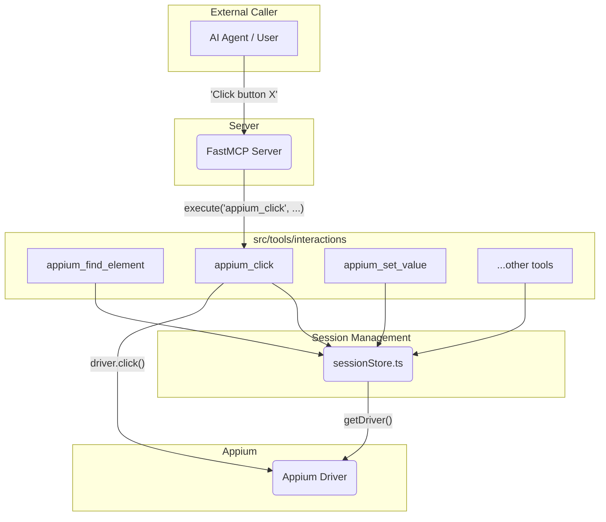
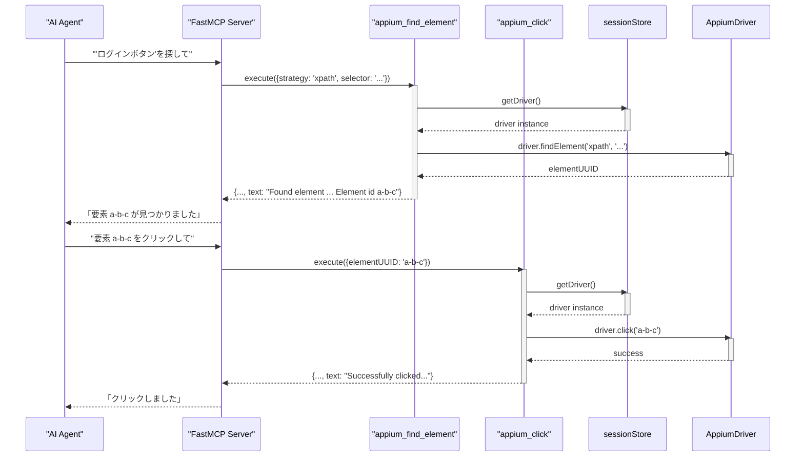
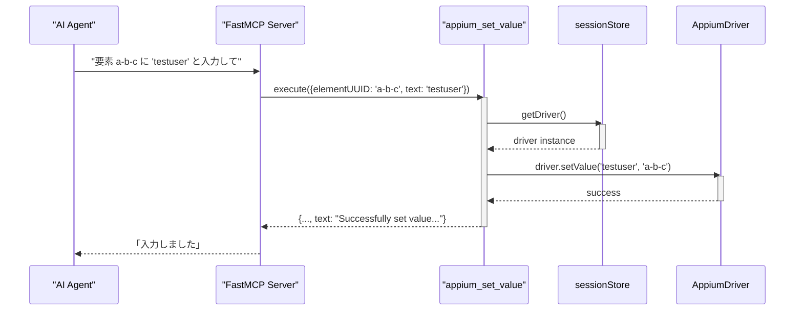
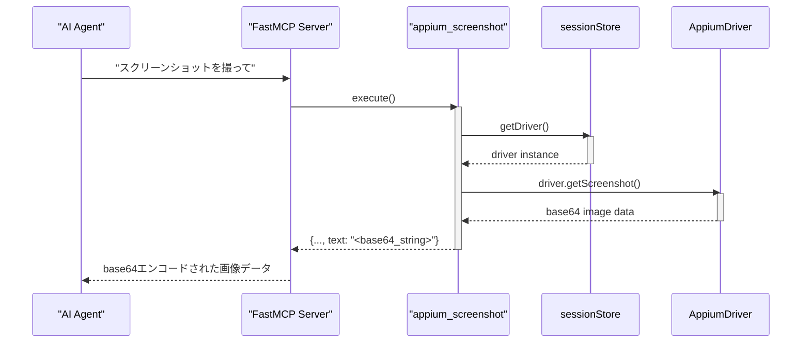

# 1. ソフトウェアの目的と主要な機能

このモジュールは、Appiumが提供するドライバーの機能をラップし、モバイルアプリケーションのUIを操作するための一連の「ツール」を提供します。各ツールは、クリック、テキスト入力、要素検索などの基本的なユーザー操作を抽象化し、外部のシステム（AIエージェントなど）が簡単に呼び出せるように設計されています。これにより、自然言語の指示を具体的なUI操作に変換する処理を容易にします。

## 2. プロジェクト構造とアーキテクチャ

### ディレクトリ構造と主要な役割

`src/tools/interactions`ディレクトリ内の各ファイルは、単一のAppium操作に対応するツールを定義しています。

-   `find.ts`: 指定された戦略（XPath, IDなど）とセレクタを使ってUI要素を検索する。
-   `click.ts`: `find.ts`などで取得した要素をクリックする。
-   `setValue.ts`: 要素にテキストを入力する。
-   `getText.ts`: 要素からテキストを取得する。
-   `screenshot.ts`: 現在の画面のスクリーンショットを撮影する。
-   `activateApp.ts`: 指定したIDのアプリケーションを起動・フォアグラウンド化する。
-   `terminateApp.ts`: アプリケーションを終了する。

これらのツールはすべて、`sessionStore.js`を介して現在アクティブなAppiumドライバーインスタンスを取得し、操作を実行します。

### 主要な技術スタック

-   **言語**: TypeScript
-   **ライブラリ**:
    -   `fastmcp`: サーバーにツールとして登録するためのフレームワーク。
    -   `zod`: ツールの入力パラメータの型定義とバリデーションに使用。
    -   `webdriverio`: Appiumドライバーの操作に使用（`getDriver()`経由）。

### アーキテクチャ図

## 3. 主要な機能と処理フロー

### 機能1: 要素の検索とクリック

ユーザーが「ログインボタンをクリックして」のような指示を出した場合、まず要素を検索し、次に見つかった要素をクリックするという一連の処理が実行されます。

### findElement の詳細

`appium_find_element` ツールは、後続のインタラクション（クリック、テキスト入力など）の起点となる最も重要なツールの一つです。このツールの目的は、画面上の特定のUI要素を、指定された方法（戦略）で見つけ出し、その要素を一意に識別するためのID（`elementUUID`）を取得することです。

#### パラメータ

このツールは2つのパラメータを取ります。

1.  `strategy`: 要素を検索するための戦略です。以下の中から選択します。
    *   `xpath`: XMLのパス言語。柔軟で強力な指定が可能。
    *   `id`: `resource-id` (Android) や `name` (iOS) などの一意なID。
    *   `name`: 要素の `name` 属性。
    *   `class name`: `XCUIElementTypeButton` (iOS) や `android.widget.Button` (Android) といったクラス名。
    *   `accessibility id`: `content-desc` (Android) や `accessibility-id` (iOS) として設定されたアクセシビリティID。
    *   `css selector`: (WebView内でのみ有効)
    *   `-android uiautomator`: Android固有のUIAutomator APIを利用した検索。
    *   `-ios predicate string`: iOS固有の述語（Predicate）ベースのクエリ。
    *   `-ios class chain`: iOS固有のクラスチェーンによるクエリ。

2.  `selector`: 上記で選択した `strategy` に対応する具体的な値（例：`strategy`が`id`なら、セレクタは`'login_button'`）。

#### 返り値

検索に成功すると、ツールは `element.ELEMENT` プロパティ（内部的には `elementUUID` と呼ばれる）を返します。これは、Appiumセッション内でその要素を指し示す一意の参照IDです。`appium_click` や `appium_set_value` などの他のツールは、この `elementUUID` をパラメータとして受け取ることで、どの要素に対して操作を実行すべきかを正確に判断します。

### 機能2: テキスト入力

「ユーザー名に 'testuser' と入力して」といった指示に対応します。

### 機能3: スクリーンショット取得

現在の画面の状態を確認するために、スクリーンショットを取得します。

