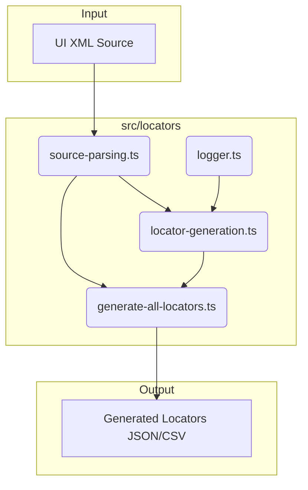
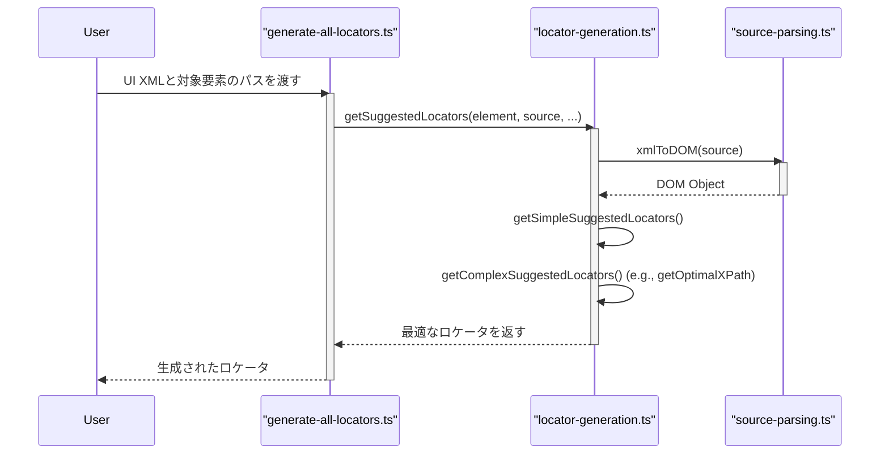
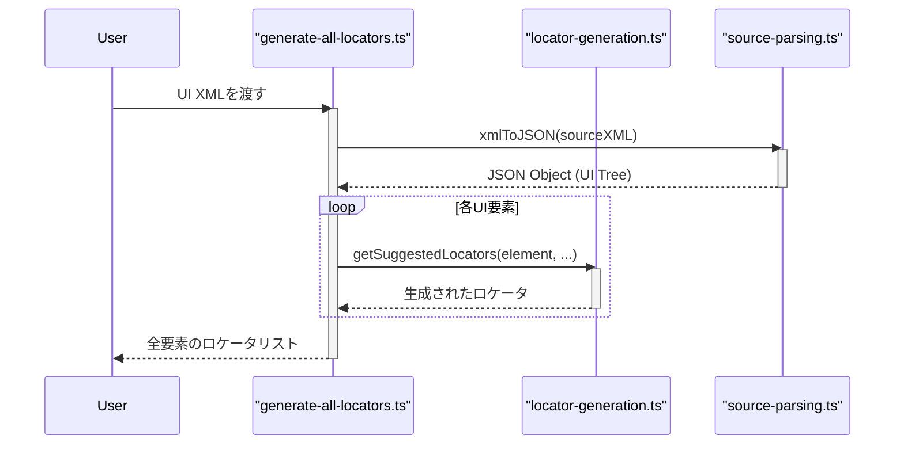
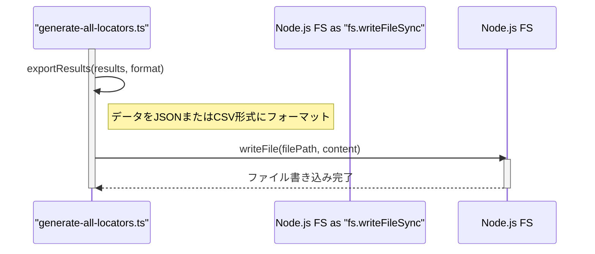

# 1. ソフトウェアの目的と主要な機能

このモジュールは、Appiumが提供するUIのXMLソースコードを解析し、各UI要素に対して最適なロケータ戦略（XPath、Accessibility ID, Class Chainなど）を自動生成することを目的としています。主な機能は、UI階層全体をスキャンして、安定的で信頼性の高い一意のロケータを特定し、テスト自動化の効率を向上させることです。

## 2. プロジェクト構造とアーキテクチャ

### ディレクトリ構造と主要な役割

-   `source-parsing.ts`: UIのXMLソースをDOMオブジェクトやカスタムJSON形式に変換するパーサー。各要素にユニークなパスを割り当て、構造を解析しやすくします。
-   `locator-generation.ts`: ロケータ生成のコアロジック。単一のUI要素を分析し、XPath、iOS Class Chain、Android UIAutomatorなど、プラットフォームに応じた最適なロケータを決定します。
-   `generate-all-locators.ts`: 上記のモジュールを統合し、UIツリー全体のすべての要素に対してロケータ生成を実行するスクリプト。フィルタリング機能も提供します。
-   `logger.ts`: 処理中の情報やエラーを出力するためのシンプルなロガー。

### 主要な技術スタック

-   **言語**: TypeScript
-   **ライブラリ**:
    -   `@xmldom/xmldom`: XMLのパースとシリアライズに使用。
    -   `xpath`: XPath式を評価し、ロケータのユニーク性を検証するために使用。
    -   `lodash`: データ操作を補助するユーティリティ。

### アーキテクチャ図

## 3. 主要な機能と処理フロー

### 機能1: 単一要素のロケータ生成

ユーザーが指定した単一のUI要素に対して、最も信頼性の高いロケータを一つ提案します。

### 機能2: 全要素のロケータ一括生成

UIのXMLソースに含まれるすべての要素をスキャンし、それぞれに最適なロケータを生成してリスト化します。

### 機能3: ロケータリストのエクスポート

一括生成された全要素のロケータリストを、JSONまたはCSV形式のファイルとして保存します。

