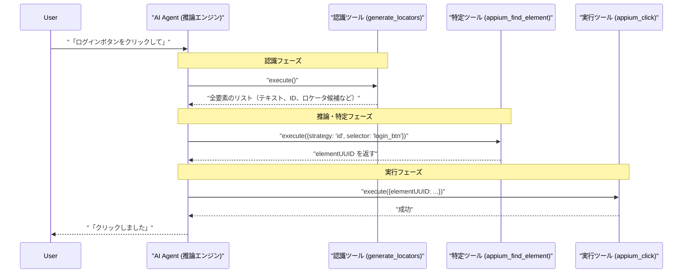

# Appium操作における認識と実行の連携アーキテクチャ

## 1. 概要

このシステムは、人間からの「ログインボタンをクリックして」といった曖昧な自然言語の指示を、Appiumによる具体的なUI操作に変換するために、**認識（Analysis）** と **実行（Interaction）** という2つの主要な機能を連携させるアーキテクチャを採用しています。

-   **認識**は `locators` モジュール（`generate_locators` ツール）が担当し、現在の画面状況を完全に把握する「目」の役割を果たします。
-   **実行**は `interactions` モジュール（`appium_find_element` や `appium_click` などのツール群）が担当し、特定の要素に対して操作を行う「手足」の役割を果たします。

この2つのモジュールを組み合わせることで、曖昧な指示から正確な操作対象を推論し、確実なアクションを実行する一連のプロセスを実現しています。

---

## 2. 主要コンポーネントの詳細

### 2.1. 認識モジュール: `generate_locators`

-   **目的**: 現在の画面に存在する全てのUI要素の情報を取得し、網羅的な「画面の地図」を作成すること。
-   **トリガー**: AIエージェントが「画面上に何があるか？」を知りたい場合に呼び出される。
-   **処理**: Appiumから現在の画面のXMLソースを取得し、パースする。各UI要素に対して、テキスト、ID、クラス名などの属性情報と共に、後続の処理で利用可能な複数のロケータ戦略（XPath, ID, Accessibility IDなど）を計算してリスト化する。
-   **出力**: 全UI要素の属性とロケータ候補を含む、構造化されたJSONデータ。

### 2.2. 実行モジュール: `interactions` ツール群

#### `appium_find_element`

-   **目的**: **正確な**ロケータ（戦略とセレクタ）を基に、特定のUI要素を一つだけ探し出し、その要素を指し示す一意な参照ID（`elementUUID`）を取得すること。
-   **入力**: `strategy`（例: `'id'`）と `selector`（例: `'login_button'`）。
-   **出力**: Appiumセッション内でのみ有効な `elementUUID`。
-   **役割**: 認識と実行の最終的な橋渡し役。AIエージェントの「推論」の結果を、操作可能な「対象」に確定させる。

#### `appium_click`, `appium_set_value` など

-   **目的**: 特定の要素に対して、クリックやテキスト入力などの具体的なアクションを実行すること。
-   **入力**: `appium_find_element` が返した `elementUUID`。
-   **出力**: アクションの成功または失敗を示すメッセージ。

---

## 3. 全体フロー

ユーザーからの曖昧な指示が、どのようにして具体的なアクションに変換されるかの全体フローを示します。

---

## 4. 組み合わせの意義

`generate_locators`（認識）と `findElement`（特定）の組み合わせは、単なるツールの連携以上の重要な意義を持ちます。

1.  **曖昧さの解決**: 人間の自然な言語（「あれ」「それ」など）と、コンピュータが要求する厳密な命令との間のギャップを埋めることができます。最初に全体を「見て」、後から一つを「指さす」という人間の認知プロセスを模倣しています。

2.  **関心の分離**: 「画面に何があるかを知る」という関心事と、「特定の要素を操作する」という関心事を明確に分離できます。これにより、各ツールは自身の役割に専念でき、システム全体のモジュール性とメンテナンス性が向上します。

3.  **柔軟性と拡張性**: 将来的にAIエージェントの推論能力が向上すれば（例：画像認識の併用）、`findElement`や`click`ツール自体を変更することなく、より高度な指示（「一番上にある赤いボタンを押して」など）に対応できるようになります。認識・推論部分と実行部分が分離されているためです。

---

## 5. その他注意点

-   **パフォーマンス**: `generate_locators`は画面全体のXMLを取得するため、UIが複雑な画面では処理に時間がかかる可能性があります。頻繁な呼び出しはパフォーマンスのボトルネックになり得ます。

-   **動的なUIへの対応**: `generate_locators`の実行後、`findElement`や`click`が実行されるまでの間に画面が変化した場合、「Stale Element Reference」（要素が古い）エラーが発生する可能性があります。AIエージェントは、このようなエラーを検知し、必要に応じて再度`generate_locators`を実行して画面を再認識するなどのエラーハンドリング戦略を持つ必要があります。

-   **一意性の問題**: 「ボタン」のように画面上に複数存在する要素を指示された場合、AIエージェントの推論ロジックがどの要素を選択するかを決定する必要があります。単純な実装では最初に見つかったものを選択するかもしれませんが、より高度なシステムでは、ユーザーに追加の質問をしたり、文脈から判断したりする能力が求められます。
